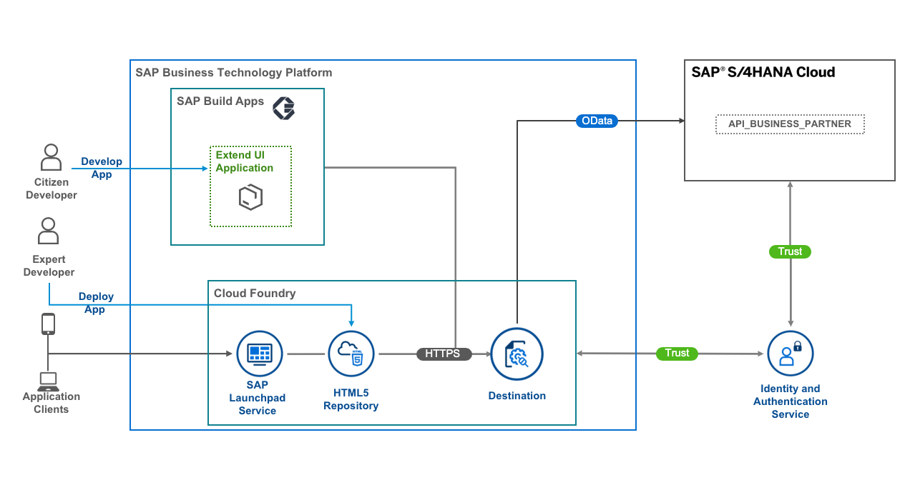
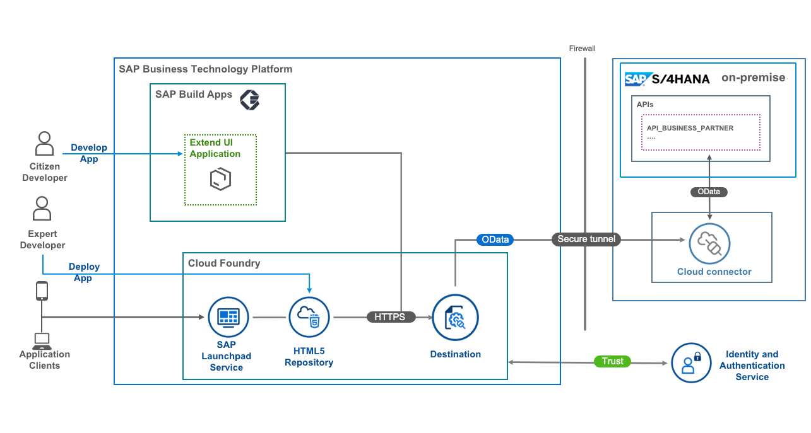

# Use SAP Build Apps to Build Side-by-Side UI Extensions for SAP S/4HANA

## Description

This repository contains the material for the SAP d-com 2023 session called *<https://github.tools.sap/d-com-2023/HO005>*.

The main focus of this session is to develop a custom UI application, which consumes an OData service from an SAP S/4HANA system.

As a citizen developer, you will create a simple custom UI application using the no-code tool SAP Build Apps, and preview it as a Web application. The complexity of the backend configuration is hidden from you.

You can find this scenario as a mission in SAP Discovery Center.

## Prerequisite

- `None`

## Overview

## Business Scenario
As a sample scenario, Jane a sales executive of ACME Corporation regularly meets different customers. She needs access to latest customer information on the go. She needs a simplified web application, which can run on a portable device like smartphone or a tablet.

ACME Corporation implements the application as an SAP S/4HANA extension on SAP Business Technology Platform (SAP BTP). This application is created with SAP Build Apps, a no-code user interface development tool.

## This scenario covers:

Building application with SAP Build Apps
Set up connectivity between SAP BTP and SAP S/4HANA Cloud or SAP S/4HANA on-premise
Deploying the application on SAP BTP, Cloud Foundry environment

## Solution Architecture
SAP S/4HANA Cloud Solution Architecture

SAP S/4HANA on-premise Solution Architecture

## Exercises

0. [ex0: Create a No-Code Application with SAP Build Apps](exercises/ex0/README.md)
1. [ex1: Create a Business Partner List Page](exercises/ex1/README.md)
2. [ex2: Create a Business Partner Details Page](exercises/ex2/README.md)

<!-- />
Comments
<!-->

## License

Copyright (c) 2022 SAP SE or an SAP affiliate company. All rights reserved. This project is licensed under the Apache Software License, version 2.0 except as noted otherwise in the [LICENSE](LICENSES/Apache-2.0.txt) file.
