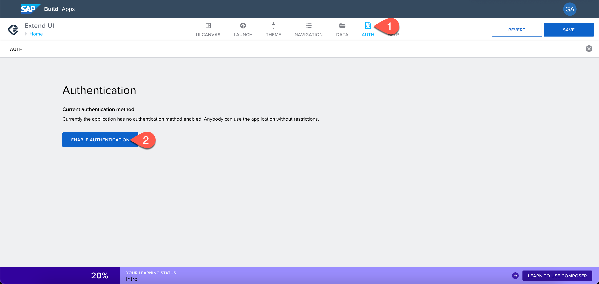
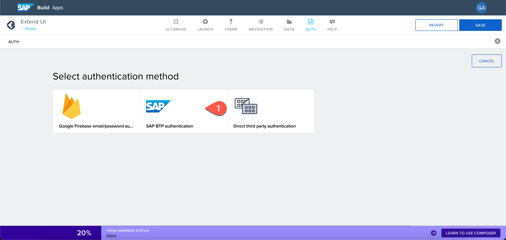

# Exercise 0 - Create a No-Code Application with SAP Build Apps

In this section, you will create an SAP Build Apps application.

**Persona:** Citizen Developer

**Abbreviation:** SAP Business Technology Platform = SAP BTP

## Open SAP Build Apps

 1. Open **SAP Build Apps Application Development** link which you have received for this workshop : https://dcom-99zd6fvy.eu10.build.cloud.sap/lobby 

 2. You would be prompted with a log in screen of a custom Identity Provider.

3. Log in to the Application using your custom Identity Provider credentials. (You would have received an activation mail from "SAP IAS No Reply" with an account activation link which you have to click and set up a password for your user account) and open the SAP Build Apps Application Development.

   

## Create an Application Using SAP Build Apps

### Create a Project

1. In the Build App dashboard, choose **Create** and choose **Build an Application**.

   

2. Choose **Web & Mobile Application**. 
   

3. Enter a **Project Name**.

4. Enter a **Short Description**.

5. Choose **Create**.

   

6. Your created project will be opened in **App Builder** which is the central page to build your application including a user interface, logic, as well as data integration.

7. Let us edit the default page, Choose **Headline** as shown in the screenshot below.

8. Find the **Properties** tab in the menu on the right to change the content of the title. Choose **Content** and change the content from **Headline** to **Extend UI Application**.

   

9. Find the text field in the UI canvas in the center of your screen and choose **x** to remove this component.

   

10. Choose the blank page. On the right side under the **Properties**, choose **Page name**.

11. Change the page name to **Home**.

    
    
12. Choose **Save** to save the changes.

### Enable Authentication

To consume data from your SAP S/4HANA Cloud System (in this workshop, with mock S/4HANA data) that is configured as a data source/destination, you need to enable authentication.

1. Choose **AUTH** at the top section of the app builder.

2. Choose **Enable Authentication**.

   

3. Select **SAP BTP Authentication** and choose **OK**. This enables authentication for the project.

   
   

### Add a Data Source

To add a data source, you need to add the following steps to your project.

1. Choose the tab **Data** at the top of App builder.

2. Find section **No systems integrated** and choose **Add Integration**.

   

3. On the next screen **SAP Systems**, select **BTP Destinations**.

4. Select the destination from the list, in this workshop, select **bupa_mock**.

5. Under the **Data entities**, select **Search** and enter **A_BUSINESSPARTNER**.

6. Choose **Install Integration**.

   

7. After installing integration, you'll see **Enable Data Entity**. Choose **Enable Data Entity** to enable it.

8. Now, search for **A_BusinessPartnerAddress** and choose **Enable Data Entity**.

9. Choose **Save** at top of the app builder. This adds the data source to your project. 
10. Choose **UI Canvas** in the top menu bar, which takes you back to the UI designer view.
