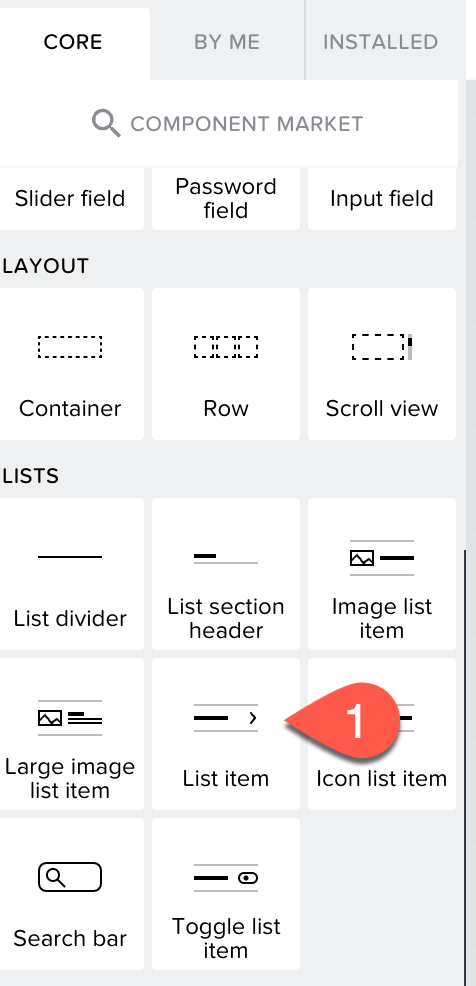
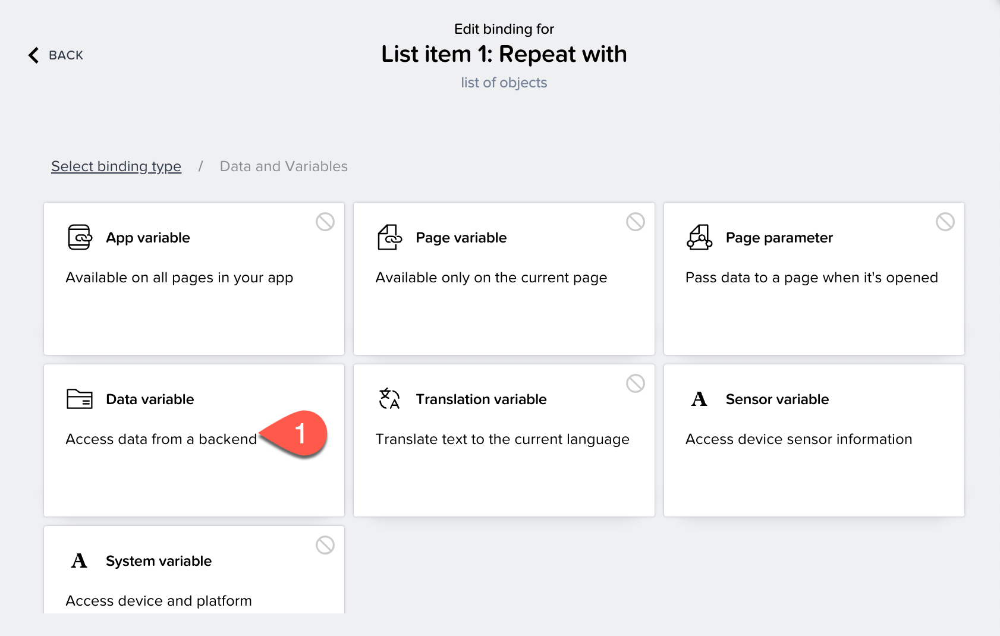

# Exercise 1 - Create a Business Partner List Page

To create the page displaying the list of business partners, you need to first create a **Data variable**.

#### Data Variable

A data variable is essentially the same as a page variable that exists in the context of the current page that is not accessible from other pages, and disappears if the page is removed from the navigation stack. The difference is that it gets its schema from the data resource it points to, and it comes with included default logic.

### Creating a Data Variable

1. From the UI canvas, choose the toggle button to switch from **VIEW** to **VARIABLES**.

2. Choose **DATA VARIABLES** on the left side of app builder.

3. Now, choose **ADD DATA VARIABLE** and select **A_BusinessPartner**.

    

4. Choose **SAVE**.

Now that the data variable is created, toggle back to the **VIEW** mode.

### Creating a Business Partner List

At this step, you are creating a Business Partner List page in app builder.
#### Check That the Data Is Visible in the UI

1. On the left panel of UI CANVAS, you see the **CORE** tab, scroll to the **LISTS** section and choose **List item**.

   

2. Drag the **List item** to the application **Home** page.

3. On the right side **PROPERTIES** section, scroll to **Repeat with** and select it.

4. A popup opens. Select **Data and Variables**, choose **Data variable**.

   

5. Select **A_BusinessPartner1** from the list and choose **SAVE**.

#### Bind the Data Variable to the List

1. Choose the list.

2. Go to **PROPERTIES**.

3. Choose Primary Label **ABC**.

   

4. Choose **Data item in repeat**.

5. Choose **current**.

6. Select **BusinessPartner**, scroll and choose **SAVE**.

   

7. Go to **PROPERTIES**.

8. Choose Secondary Label **ABC**.

9. Choose the **Data item in repeat**.

10. Choose **current**.

11. Select **BusinessPartnerFullName**, scroll and choose **SAVE** to add the data variable to the list.

13. Choose **SAVE** to save the changes in the application.

### Preview the Application

1. Choose **LAUNCH** and choose **OPEN PREVIEW PORTAL**.

   

2. A new tab opens, choose **Open web preview** in **Preview on Web**.

3. Select the application you have created and choose **OPEN**.

4. The application is launched in the preview portal with mock data.

    

The application's first page is now displayed. Let us now create a second page which shows the details of the selected business partner.

